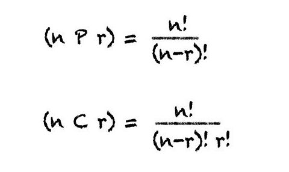
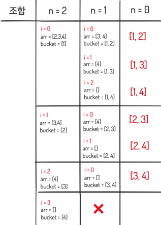
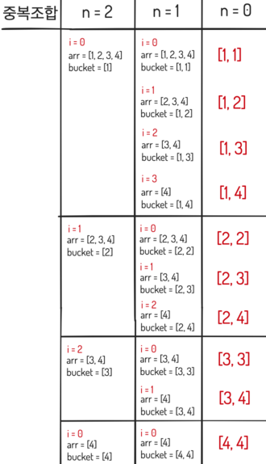

**순열과 조합**은 컴퓨터 과학에서 매우 중요한 주제중 하나며 실생활에서도 매우 유용하게 쓰인다.

위의 공식은 각각 순열과 조합의 공식이다. 코드로는 어떻게 나타낼까?

## 중복 순열

**중복 순열**이 순열보다 간단한 로직이라 먼저 설명해 보겠다.

숫자 1, 2, 3 중에서 순서를 구분하고 중복을 허용하여 2개를 뽑는 모든 경우를 구해보자.

### 반복문

```js
function permutation() {
  let result = []
  let table = [1, 2, 3]

  for (let i = 0; i < 3; i++) {
    for (let j = 1; j < 3; j++) {
      result.push([table[i], table[j]])
    }
  }
  return result
}
```

> 반복문으로 구현한 중복 순열

코드 작성도 쉽고 이해도 간단하다. **하지만,** 지금처럼 뽑는 개수가 2로 고정되어 있지 않고, 유동적으로 변할 때는 <u>뽑는 횟수 만큼 반복문을 추가 작성</u>하여야 한다.

만약 뽑는 개수가 2가 아닌 10이라고 생각하면 무려 10중 반복문을 작성해야 하며, 작성된 코드는 마치 콜백 지옥과도 같을 것이다.

### 재귀 (DFS)

```js
const permutation = n => {
  let table = [1, 2, 3]
  let result = []

  let dfs = (cnt = n, bucket = []) => {
    if (cnt === 0) {
      result.push(bucket)
      return
    }
    for (let choice of table) {
      dfs(cnt - 1, [...bucket, choice])
      // dfs(cnt - 1, bucket.concat(bucket))
    }
  }
  dfs()
  return result
}
```

> 재귀적으로 구현한 중복 순열

뽑은 숫자를 담아둘 배열 `bucket`을 만들고 변수 `cnt`가 0이 될 때까지 재귀가 돌아가면서 bucket에 숫자가 담기게 되며, cnt가 0에 도달하면 result 배열에 push한다.

코드에서 명시된 반복문은 1개이지만 파라미터 `n`으로 전달된 값에 따라 재귀함수가 알아서 n 겹의 반복문을 실행시킨다. 반복문으로 구현한 것에 비해 훨씬 깔끔하고 보기 좋다.

한가지 조심할 점은 배열은 **참조 자료형**이므로 재귀함수 `dfs`의 두 번째 인자로 매번 <u>다른 주소를 가진 새로운 배열</u>을 보내줘야 한다. 따라서 `Spread Syntax` 또는 `concat 메서드`를 활용해 **얕은 복사**를 해준다.

이후 다룰 **순열**, **조합**은 전부 반복문이 아닌 재귀적으로 구현해 볼 것이다.

## 순열

그렇다면 중복이 불가한 순열은 어떻게 구현할까?

이전에 뭘 뽑았든 상관없이 매 선택마다 1, 2, 3 중 하나를 선택한 중복 순열과는 달리 순열의 경우 앞서 1을 선택했다면 이후부턴 1은 선택할 수 없다. 이 점을 유의하며 작성해보자.

```js
function permutation(n) {
  let table = [1, 2, 3]
  let result = []

  let dfs = (cnt = n, bucket = [], arr = table) => {
    /* 
     매 재귀함수마다 이전에 선택된 숫자는 사용할 수 없기에 전역변수 table을 기준으로 
     for문을 돌면 어떤 숫자가 이미 사용됬는지 파악하기 힘들다. 
     따라서 각 재귀함수 호출 시 이전에 선택된 요소를 삭제한 새로운 배열을 전달인자로 보낸다.
     */
    if (cnt === 0) {
      result.push(bucket)
      return
    }
    for (let i = 0; i < arr.length; i++) {
      // 중복 순열과 달리 idx가 중요하기 때문에 for ..of를 쓰지 않는다.
      let clone = arr.slice()
      // splice 메서드는 mutable하므로 얕은 복사를 구현한다.
      let choice = clone.splice(i, 1)
      // 인덱스 i에 해당하는 숫자는 현재 단계에서 사용했으므로 제거한다.
      dfs(clone, [...bucket, choice])
    }
  }
  dfs()
  return result
}
```

재귀함수 `dfs`의 인자로 `arr`를 새롭게 추가하였으며, 이전에 선택된 요소를 `splice`로 제거한 새로운 배열을 전달인자로 보내준다.

## 조합

**조합**은 앞서 설명한 (중복) 순열보다는 조금 복잡하다. 우선 중복이 없기 때문에 이전에 선택한 값은 다음엔 선택하지 않도록 해야 하며, 순서가 없기 때문에 역설적으로 순서도 중요하다...

```js
const combination = n => {
  const table = [1, 2, 3, 4]
  const result = []

  const dfs = (arr = table, bucket = [], cnt = n) => {
    if (n === 0) {
      result.push(bucket)
      return
    }

    for (let i = 0; i < arr.length; i++) {
      const choice = arr[i]
      const sliceArr = arr.slice()
      // i = 1일 때 1로 만들 수 있는 모든 조합을 만든다.
      // i = 2일 때 2로 만들 수 있는 모든 조합에서 1이 제외된 조합을 만든다.
      // i = 3일 때 3로 만들 수 있는 모든 조합에서 1, 2이 제외된 조합을 만든다.
      // i = 4일 때 4로 만들 수 있는 모든 조합에서 1, 2, 3이 제외된 조합을 만든다.

      // 순열은 현재 인덱스 i 에 해당하는 요소만 지우지만,
      // 조합은 0부터 현재 인덱스까지의 모든 요소를 지운다.
      dfs(sliceArr.slice(i + 1), [...bucket, choice], n - 1)
      //  dfs(sliceArr.slice(i), [...bucket, choice], n - 1) [중복 조합]
    }
  }
  dfs()
  return result
}
```

위 코드에서 **딱 한 글자**만 수정하면 **중복 조합**을 구현할 수 있다.

```js
dfs(sliceArr.slice(`FILL_THIS`), [...bucket, choice], n - 1)
// FILL_THIS = i + 1 => 조합
// FILL_THIS = i => 중복 조합
```

조합과 중복조합의 로직은 선뜻 이해하기 어려웠기 때문에 직접 화이트보드에 그려 보았다.
`arr`, `bucket` 각 우항은 현재의 값이 아닌 <u>다음 재귀함수에 넘겨주는 전달인자</u>를 뜻한다.

### 조합 시뮬레이션

---



### 중복 조합 시뮬레이션

---



### pickOrNot

---

**멱집합**을 구현할 때 자주 사용하는 `pickOrNot`이란 방법을 사용해도 조합을 구현할 수 있다.

재귀함수는 함수 내에서 자신을 2번 호출하는 데, 각각 <u>뽑는 경우</u>와 <u>뽑지 않는 경우</u>에 대응한다.

```js
const combination = n => {
  const table = [1, 2, 3, 4]
  const result = []

  const pickOrNot = (idx, basket) => {
    if (basket.length === n) {
      result.push(basket)
      return
    }
    if (idx === table.length) return
    // idx가 table.length 이상인데도 n개를 뽑지 못한 경우는 재귀 탈출
    pickOrNot(idx + 1, basket.concat(table[idx]))
    pickOrNot(idx + 1, basket)
  }
}
```
