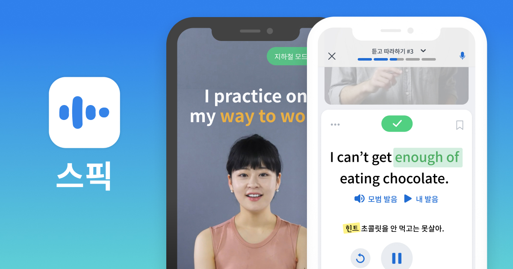

나는 학창시절 때도 영어를 잘 하는 편은 아니었고 지금도 그렇다.  
하지만 유명한 프로그래밍 유튜버나 주변 사람들의 말을 들으면 항상 하는 말은,

> _"프로그래머들이 가장 먼저 배워야 하는 언어는 Python도, Java도 아닌 영어이다."_

> _"영어를 못해도 물론 개발자는 될 수 있다. 하지만 주니어 이상으로 발전할 순 없다."_

> _"영어를 못하는 프로그래머는 결국 우물 안 개구리다."_

내가 공부하면서 신세 많이 진 `Nomad Coder` , `생활코딩` 등의 실력있는 프로그래머들은 전부 영어의 중요성을 강조했다. 이런 말을 계속 들으면서 속으로는 _공부해야지.._ 하면서도 계속 미뤄왔다. 허나 더는 미룰 수 없다.

`학원` 의 경우는 금전적인 문제때문에 패스하고, `유튜브나 책` 등으로 독학을 해보자니 내 성격상 **작심삼일**이 될 것이 뻔하다. 결국 <u>상대적으로 저렴</u>하고 많은 기능이 있는 `앱` 을 찾아보았는데, 아래 두 앱은 현재 정말 유용하게 사용 중이다.

---

### 1️⃣ 말해보카

  
`말해보카` 는 단어를 외우는 데 있어서는 <u>현존 최고</u>의 어플리케이션이라고 생각한다.

한국어도 그렇고 영어 또한 한 단어에 대응하는 뜻은 2개 이상인 경우가 많아 공부가 쉽지 않다.  
`말해보카` 는 단어의 뜻을 네이버 사전마냥 1,2,3..처럼 나열해서 가르쳐 주는 게 아닌, 각각의 뜻마다 빈칸이 뚫린 예문을 하나씩 제시하며 사용자가 맞춰보게끔 하는 식이라 어떤식으로 쓰이는 지를 알 수 있어 학습이 너무 편하다.

또한 해당 단어의 적절성을 기준으로 내가 쓴 답을 `맞음` , `비슷` , `오답` 으로 구분하는데, 맞음과 오답의 경우는 전자는 주어진 문맥에서 쓸 수 있는 최고의 표현을 뜻하고 후자는 말 그대로 완전 틀린 표현을 의미한다.

여기서 또 말해보카를 고평가할 수 있는 부분이 `비슷` 이라는 평가 기준인데, 이는 이러한 단어를 사용해도 완전 틀리다고는 할 수 없지만, 원어민들은 거의 사용하지 않는 어색할 표현을 뜻한다.

아래 예문을 통해 어떤 식으로 되는 지 다시 설명해 보자면,

```
"My best friend is [    ]."
```

이 경우, `Jewish` 라고 입력하면 `맞음` 인데, `a jew` 라고 입력하면 `오답`이 되는데, _a jew_ 라는 표현은 상대방이 불쾌하게 받아들일 수 있기 때문이다.

---

### 2️⃣ 스픽



`스픽` 은 이름 그대로 **스피킹**에 초점을 둔 회화연습용 어플리케이션이며, 비슷한 기능을 제공하는 앱 중에선 가장 좋다고 생각한다.

가장 두드러지는 특징은 **압도적인 스피킹량**이라고 할 수 있다. 가령 _<u>오늘이 무슨 요일인지</u>_ 를 표현하는 법을 배울 때 비슷한 문장을 **대략 20~30번** 정도를 직접 말하게끔 시킨다.

<!-- 한국식 영어 교육을 꾸준히 받아온 나로서는 독해를 할 때는 분명 아는 표현이 많지만 정작 그 표현을 사용하려면 잘 나오지 않는 경우가 태반이다. -->

강의 전체적으로는 너무 어려운 표현은 없다. 고등학교 과정을 무사히 이수했다면 대부분의 표현은 어느정도 손쉽게 해석할 수 있다.

**하지만** 스픽의 핵심은 머리로 해석을 하게 해주는 것이 아닌, 아는 표현은 즉시 입 밖으로 내게 해주는 것이다. <u>아는 표현이라 생각했지만 정작 입 밖으로 나오지 않는 표현들</u>, 그런 것들은 *수많은 반복*을 통해서 입에 붙게 만들어 주는 것이 바로 스픽의 역할인 것 같다.

## 마치며

물론 저런 앱으로만 몇 년을 공부해도 영어를 잘 할 수는 없을 것이고, 더 많은 것을 배워야 할 것이다.

하지만, 영어 왕초보인 나로서는 우선 이런 간단한 것부터 시작해서 영어에 대한 재미와 자신감을 어느정도 늘린 뒤에 단계적으로 <u>고급 문법</u>, <u>작문</u>, <u>비즈니스 영어</u> 등을 배우는 것이 중간에 포기하지 않게 계속 공부 할 수 있을 것이다.
