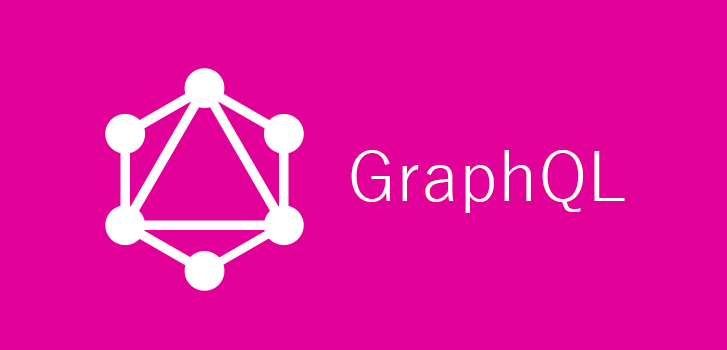

GraphQL이 해결해주는 2가지 문제

[ Over Fetching ]
필요한 데이터 이상을 받는 것.
REST API의 경우, 데이터 테이블을 요청할 때 모든 필드를 받아 옴
예) user의 username만 필요하더라도 profile, email, etc. 를 모두 꺼내서 response로 보냄

[ Under Fetching ]
필요한 데이터를 받기 위해 1번 이상의 request를 보냄.
REST API의 경우 나뉘어진 테이블 만큼의 reqest를 보내고 각각의 response를 받음
예) 앱 실행 시, feed 데이터, user데이터, notification데이터 etc. 모두 각각의 request를 보냄

---

Graphql은 URL은 존재하지 않는다. 오직 하나의 endpoint(종점)만 존재한다.
