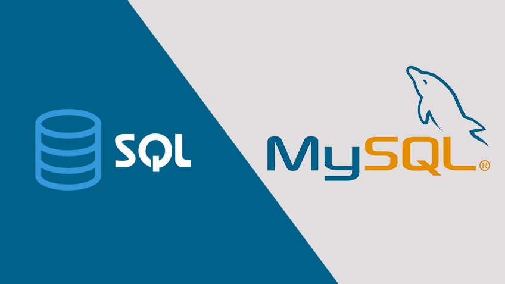

sql은 structured query language의 약자이며, 데이터베이스와 소통을 하기위해 고안된 언어이다. 데이터베이스는 관계형이냐, 비관계형이냐에 따라서 크게 2가지로 나뉜다. 관계형 데이터베이스로는 mysql, postgresql, sqlite 등이 있고 비관계형 데이터베이스에는 mongoDB, DynamoDB 등이 있다.

쿼리는 데이터베이스에 저장되어 있는 데이터를 필터하기 위한 질의문이다.
select \* from user
