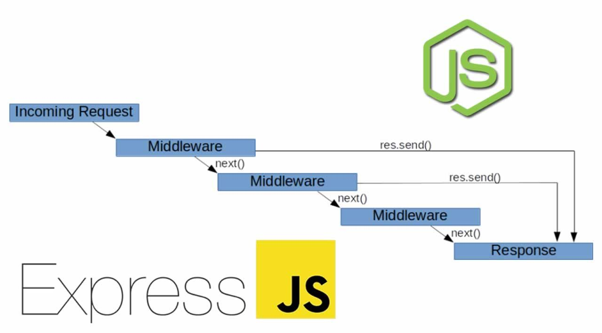

Express.js는 Node.js 환경에서 웹 서버, 또는 API 서버를 제작하기 위해 사용되는 인기 있는 프레임워크이다.

Node.js 만으로도 서버를 구축할 수 있음에도 Express.js가 널리 쓰이는 이유는 아래와 같다.

- 미들웨어 추가가 편리
- 자체 라우터 기능 제공

## 기본 환경 구성

우선 프로젝트 폴더를 만들고 package.json 생성을 위해 npm init을 입력한다.

서버 코드를 수정 후 저장 시, 서버를 자동으로 재부팅시키기 위해 nodemon 또한 설치한다.

```bash
mkdir learn-express
cd learn-express/
npm init # 기본 설정에 대해 물어보면 그냥 전부 Enter 클릭
npm i nodemon
```

`nodemon` 을 편하게 실행하기 위해 package.json 파일의 scripts를 수정한다.

또한 여기선 Common.js의 `require` 가 아닌 **ES6**의 `import` 를 사용할 것이기 때문에 package.json 파일에 `"type": "module"` 을 추가한다.

```json
 ...
 "type": "module",
 "scripts": {
    ...
    "start": "nodemon index.js" // 서버 파일
  },
 ...
```

## Express.js 기본

```js
import express from 'express' // [ES6]
// const express = require('express') [CommonJS]

const app = express()
const port = 3000

app.get('/', (req, res) => {
  res.send('Hello World')
})

app.listen(port, () => {
  console.log(`server listening at http://localhost:${port}`)
})
```

### CORS

```js
import cors from 'cors' // npm i cors로 먼저 설치 필요

// 1️⃣ 모든 요청에 대해 CORS 허용
app.use(cors())

// 2️⃣ 특정 요청에 대해 CORS 허용 (경로로 구분)
app.get('/', cors(), (req, res) => {
  res.send('Hello World!')
})

// 3️⃣ CORS에 옵션 추가
app.use(
  cors({
    origin: `http://onlyAllowThisOrigin.com`,
  })
)
```

### 라우팅

```js
// app.method(path, handler)

app.get('/', (req, res) => {
  res.send('Hi World!')
})

app.post('/users', (req, res) => {
  // do something I need
})
```

### Parsing Req Body

```js
app.use(express.json())
// Content-type이 application/json인 바디 파싱
// express.json({strict:false}) => json 형식 외의 자료형도 파싱 가능

app.use(express.urlencoded({ extended: true }))
// false면 기본으로 내장된 querystring 모듈 사용
// true면 따로 설치가 필요한 qs 모듈 사용
```

### Query / Params

```js
// Using Parameter => req.params
// GET '/posts/someid'
app.get('/posts/:id', (req, res) => {
  const data = posts.filter(post => {
    return post.id === req.params.id
  })
  return res.json(data)
})

// Using Query String => req.query
// GET 'posts/?title={query}'
app.get('/posts', (req, res) => {
  if (req.query.title !== undefined) {
    const filteredPosts = posts.filter(post => {
      return post.title.includes(req.query.title.toUpperCase())
    })
    return res.status(200).json(filteredPosts)
  }
  res.json(posts)
})
```

## Middelware



- Express.js의 메커니즘은 <u>미들웨어 함수 호출의 연속</u>이라 할 수 있다.

- 미들웨어 함수는 **요청객체(req)**, **응답객체(res)**, **다음 미들웨어 함수를 호출하는 함수(next)**.

- 하나의 미들웨어 함수가 끝나면 다음 미들웨어 함수(next)를 호출한다. 순차적으로 호출되기 때문에 순서가 중요하다. 만약 이어받을 미들웨어가 더 없다면 끝나게 된다.

### Middleware 사용 예시

- 요청/응답에 CORS 헤더를 붙일 때

```js
const cors = require('cors')

app.use(cors()) // 모든 요청에 대해 CORS 허용
```

- POST 요청 등에 포함된 body를 파싱할 때

```js
const express = require('express')

app.use(express.json())
app.use(express.urlencoded({ extended: true }))
```

- 디버깅

```js
const myLogger = function(req, res, next) {
  // 커스텀 미들웨어 함수
  console.log('LOGGED IN...')
  next() // 다음 미들웨어 함수 호출
}

app.use(myLogger) // 모든 요청에 대해서 미들웨어 함수 myLogger 적용

app.get('/', function(req, res) {
  res.send('Hello World!')
})
```

- 요청 헤더에 사용자 인증 정보가 있는지 파악할 때

```js
// 관리자 권한 확인
const checkAdminUser = (res, req, next) => {
  if (req.headers.Auth) {
    next()
  } else {
    res.status(400).send("You don't have access")
  }
}

app.post('/adminUser-only', checkAdminUser, (res, req) => {
  // ...
})
```
