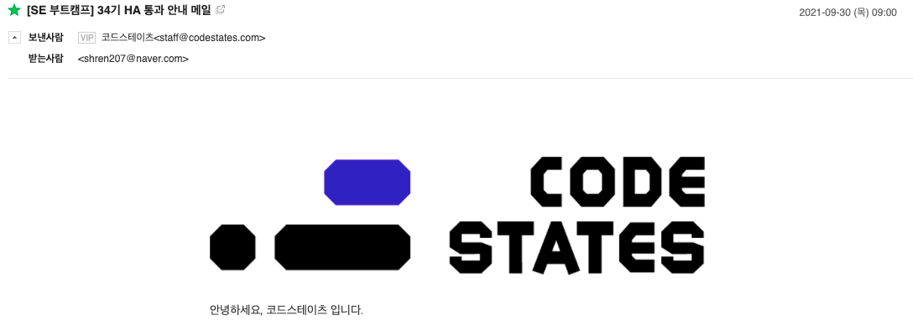

> _**2021.09.30. HA 통과!**_

## 느낀점

오늘 오전에 HA 통과 메일을 받았다! 이전의 기수이동의 충격 덕분에 배운 내용들 정말 열심히 복습했으니까. 특히 이전에서 어려웠던 React의 State와 Props는 과장 좀 보태서 누가 옆에서 툭 치면 관련 개념을 설명할 정도로 공부했다.

시험 당일 "또 기수이동 하는 건 아니겠지"하며 약간 떨리기도 했으나 괜한 걱정이었고, 1시간 내외로 모든 문제를 다 풀 수 있었다.

## 섹션 2에서는...

섹션 2부터는 우선 매일 아침 9시부터 1시간동안 알고리즘 문제를 풀어야 하는 점이 큰 특징이며, 배우게 될 내용들은 크게 자료구조, React 심화, Node.js로 간단한 서버 구현, Redux 등이며, 사실 지난 한달 간 남는 시간에는 간단히 예습 또한 진행하였다.

분명 섹션 1보다는 배로 힘들 것이다. 하지만 지금까지 느낀 바로는 계속 하면 된다는 것이다. 지난 한 달간 느꼈전 점을 잊지 않고 공부하는 방법을 섹션 2에 그대로 적용한다면 분명 꾸준히 성장하는 나 자신이 될거라 믿는다! 👍
