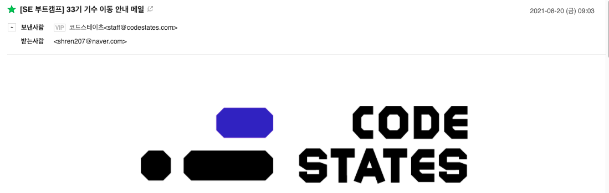

> _**2021.08.21. 기수이동 ㅜㅜ**_

## 기수이동

> 오늘 오전에 날아온 기수이동 안내 메일

오늘 기수이동을 하게 됬다는 메일을 받았다. 섹션 1에서 배운 내용을 1달 더 공부해서 HA를 다시 치뤄야 한다.
이미 결과가 나왔고 거기에 대해 한탄해 봤자 의미없으니 원인을 분석해보고 앞으로의 공부 방식에 대해 생각해보자.

### 1️⃣ 더닝 크루거 효과

> 더닝 크루거 효과를 나타내는 그래프

섹션 1을 진행하면서 내가 페어분께 가르침을 받은 적은 없고 드린 적만 있었고, 비록 겉햛기식이기는 하나 React를 이전에 공부를 했던 점, 마지막으로 모든 과제를 누락없이 전부 제출해냈단 점에서 나의 자신감은 우매함의 봉우리 쯤 위치했던 것 같다.

그래서 "내가 모르면 남은 더욱 모르겠지"라는 정말 안이한 태도가 조금 있었고, 그런 것들이 쌓여 공부가 조금씩 소홀해 진 것은 아니었나 싶다.

### 2️⃣ 절대적인 공부시간 확보 부족

당시 나는 주말마다 부모님 일을 도와드려야 했고, 집에 돌아오면 너무 지쳐서 공부를 하지 않았다. 물론 정말 절박했다면 아무리 지치더라도 집에 돌아오고도 공부를 했을 텐데, 앞서 말했다시피 내 자신감이 *우매함의 봉우리*에 위치했기 때문에, 공부를 하지 않는 것에 대해 위기감을 적게 느낀 이유도 있다.

## 앞으로

어찌 됬든 한 달 더 공부하게 됬으니, 부족한 부분을 다시 배워서 오히려 전화위복의 기회로 삼아야 겠다. React를 중점적으로 공부하고, 그 다음으로 부족했던 DOM도 확실하게 해 두어야 겠다! 다음 회고는 HA 통과를 축하하는 내용이 되길.. 🥲
