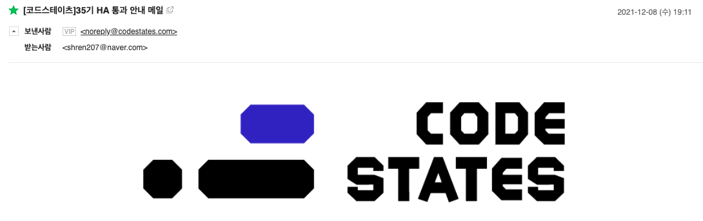

> _**2021.12.09. 도르마무, 한번 더 하고 왔다**_

## 일단 통과

어제 저녁, 위와 같은 HA 통과 안내 메일을 받았다. 기쁘진 않고 그러려니 했다. 왜냐하면 이번이 두번째 섹션2 HA였기 때문이다.
_"뭐야, 그럼 섹션 1에 이어서 또 기수이동한거야?"_ 라고 생각할 수 있는데 반은 맞고 반은 틀리다. 우선 기수이동한 것은 사실이다.
하지만 이번에는 <u>기수이동을 당한 것이 아닌, 기수이동을 한 것</u>이다.

## 왜?

### 1️⃣ 부족한 자신감

섹션 2에서 배웠던 것들 중 최후반부의 서버 구축, Redux 부분의 이해가 어려웠고, 시험도 턱걸이로 통과한 것 같다.
이렇게 허술한 상태에서 섹션 2보다 배로 어려운 섹션 3로 넘어가게 된다면 갈팡질팡하며 무의미하게 시간을 소비할 수도 있다는 두려움이 들었다. 실제로 선배 기수들의 회고록 등을 몇몇개 참고해 보았는데 일부는 실력이 부족했는데 기수 이동을 하지 않아 후회했다는 글도 더러 있었는데, 진위 여부랑 상관없이 이런 글들이 나를 두렵게 만들었던 것 같다.

과제들도 어려웠지만, 매일같이 푸는 **Toy Problem**도 너무 어려웠다. 하루 1시간동안 1문제를 풀도록 되어 있으나 3시간 정도는 투자하지 않으면 안되는 난이도였다.. 이런 것들이 쌓여 내 자신감을 계속 떨어뜨린 것 같다.

### 2️⃣ 부족한 공부 시간

나는 주말에 항상 부모님 일을 아침 일찍부터 오후늦게까지 도와드려야 한다. 부모님 하시는 일이 계속 성수기라 일손이 부족하기에 내가 도와드릴 수 밖에 없었다. 일하는 사람이 아버지랑 나밖에 없기 때문에 쉬는 시간없이 풀타임으로 항상 일을 하게되는데, 때문에 집에 오면 너무 지쳐서 항상 침대에 바로 몸을 던졌다...

한가지 긍정적인 소식은 12월 이후로는 비수기가 되기 때문에 내가 안 도와드려도 된다는 점이다.

## 앞으로

드디어 섹션 3 과정을 밟게 되었다. 이전 섹션에서는 프론트엔드 부분에 좀더 집중되어 있었다면 섹션 3는 백엔드, 데브옵스 부분에 집중되어 있다. 나는 프론트엔드를 지망하지만, 모든 부분이 결국 유기적으로 연결되기 때문에 이 과정을 절대 소홀히 할 수 없다.

또한 섹션 3 과정이 개발과 관련해서 코드스테이츠가 제공하는 마지막 과정이다. 따라서 마지막까지 열심히 공부해서 유종의 미를 거두도록 하자!
