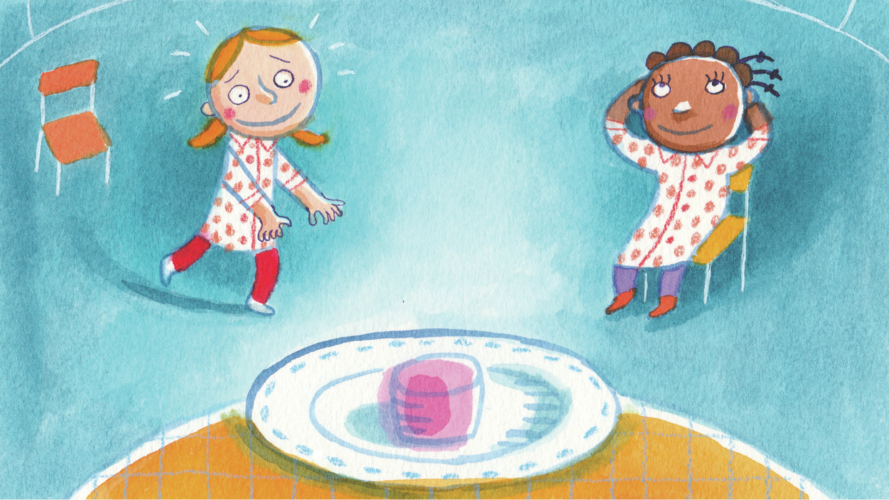
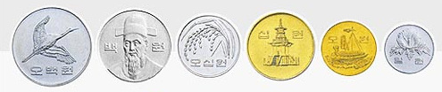

> 당장 눈 앞의 마쉬멜로에 눈이 멀어 "기다렸다 2개를 먹음"이라는 최적해를 놓친 소녀...

**그리디 알고리즘**이란 <u>매번 선택의 순간마다 당장 눈 앞의 최선의 상황만을 좇는 알고리즘이다.</u> 위 사진처럼 숲이 아닌 나무만 보는 **극단적인** 알고리즘이기에 항상 최적을 결과를 내진 않는다.

그리디 알고리즘으로 최적의 결과를 도출하려면 다음 두 조건을 만족해야 한다.

- **탐욕 선택 속성** : 앞의 선택이 이후 선택에 영향을 주지 않음, <u>즉 선택을 다시 고려하지 않음</u>

* **최적 부분 구조** : 문제의 최적 해결 방법이 부분 문제의 대한 최적 문제 해결방법으로 구성

솔직히 저렇게만 보면 이해는 어렵다. 그렇기에 그리디 알고리즘을 설명할 때 항상 등장하는 예제인 `동전 문제`를 통해 자세히 이해해보자.

## 동전 문제



> 거스름돈이 627원이 나왔을 때, 동전의 개수를 최소로 해서 거슬러 주려면?

그리디 알고리즘으로 동전을 꾸리려면 우선 최고액인 `500원 동전` 1개를 선택한다. 그 다음에도 고액순으로 `100원 동전` 1개, `10원` 2개, `5원` 1개, `1원` 2개 순으로 각각 선택할 것이다.

여기서 한번 동전을 선택하면 무르기는 없다. 즉 각각의 동전 선택이 최선이라 믿고 끝까지 간다.

627원 일 때 최선은 500원, 127원일 때 최선은 100원, 27원일 때 최선은 10원 2개, 7원일 때 최선은 5원, 2원일 떄 최선은 1원 2개, 즉 부분 문제마다 항상 최선의 선택을 한다.

```js
let cnt = 0
const change = 627
const coins = [500, 100, 50, 10, 5, 1]
for (let coin of coins) {
  let quotient = parseInt(change / coin)
  let rest = change % coin
  if (rest > 0) {
    cnt += quotient
    change = rest
  }
}

console.log(cnt) // 7 [500(1) + 100(1) + 10(2) + 5(1) + 1(2)]
```

여기서는 <u>'무조건 고액의 동전 순으로 거슬러 준다'</u>는 그리디 알고리즘이 통했지만, 만약 동전들이 위의 예제와 같이 `배수 관계`를 이루지 않고 `500, 400, 300, 200, 100, ...` 과 같은 형태였다면 그리디 알고리즘으로는 최적해를 찾을 순 없기에 **다이나믹 프로그래밍(DP)** 등의 기법을 사용해야 한다.
