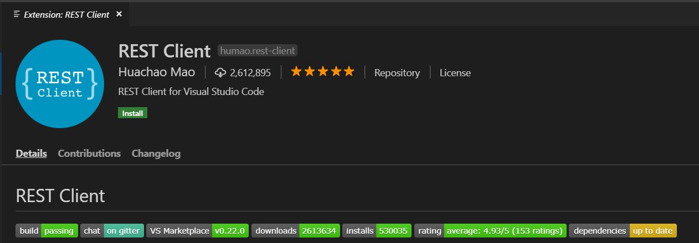
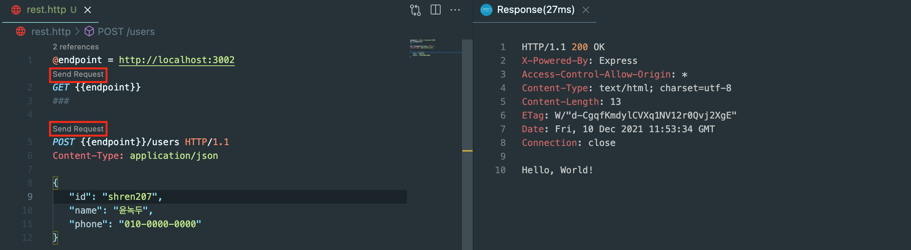

흔히들 쓰는 **Postman** 은 간단히 쓸 수 있는 API 테스트 툴이지만 몇가지 문제점이 있다.

1. 요청의 저장이 불편하며, 저장해도 날라가는 경우가 종종 있다.
2. 반복되는 endpoint를 일일이 다 써줘야 한다.

VSC 익스텐션인 `REST client` 는 앞서 설명한 Postman의 단점을 해결하였으며, 사용법 또한 간단해서 가볍게 정리해보고자 한다.

## 사용법

우선 **요청을 저장할 파일**을 만들어야 한다. 확장자는 `.http` , `.rest` 이다.

그 후 파일로 가서 요청을 일괄적으로 작성하면 된다.

```r
@endpoint = http://localhost:3000
# 최상단에 변수를 선언한다. 변수는 @를 반드시 붙여야 한다.
GET {{endpoint}}

###
                               < 각각의 요청은 '###'로 구분한다.
POST {{endpoint}}/users
Content-type: application/json < Header들은 요청 밑에 작성한다.
                               < body를 보낼때는 반드시 한 칸 띄운다!
{
    "key1": "value1",
    "key2": "value2"           < 마지막 값에 ','을 쓰면 에러가 나니 조심!
}

```

REST client는 **응답**을 나타내는 Response 파일을 별도의 창으로 띄워준다.

`###` 로 요청을 구분하면 `Send Request` 버튼이 생기는데, 누르면 응답을 표시해준다.



## 쓰면서 느낀 점

**VSC extension**이니까 1️⃣ <u>서버코드와 요청/응답을 한 화면에서 볼 수 있고</u>, 2️⃣ <u>`.http` 또는 `.rest` 확장자로 열심히 만들어둔 요청을 저장</u>할 수도 있다는 점들이 너무나도 편했다.

앞으로는 **REST client**를 적극적으로 사용하고, 같이 공부하시는 분들께도 추천드려야 겠다!
